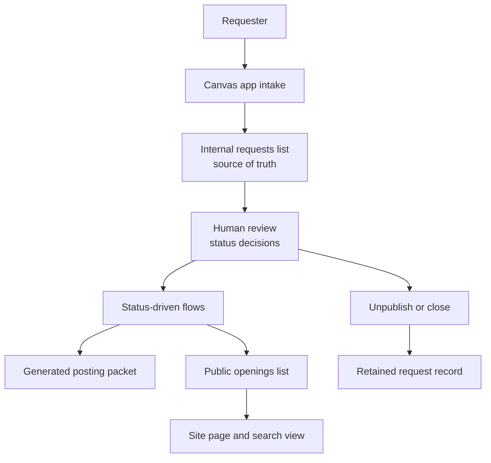

# Power Platform System Documentation Kit

Evidence-bounded method for documenting Microsoft Power Apps + SharePoint + Power Automate systems.

This repository is a **method**, not a tenant export. It exists because component-level notes (app structure, list notes, flow names, site-page notes) do not agree with each other and do not add up to an operations manual. The method forces a source of truth, evidence labels, a status map, a field dictionary, a flow register, a conflict register, and an unresolved register — and it separates current-state fact from recommendations.

The live employer system that motivated this work is **not** in this repository.

**Author:** David Di Lillo  
**Profile:** [github.com/dtdilillo](https://github.com/dtdilillo) · [linkedin.com/in/daviddilillo](https://linkedin.com/in/daviddilillo)

---

## What problem this solves

A Power Platform posting or case-management system usually has four documentation surfaces that drift apart:

1. A canvas app (intake)
2. One or more SharePoint lists (system of record and public view)
3. Power Automate flows (notifications, document generation, sync, close)
4. A site page or search list (what applicants or staff actually see)

Each surface is incomplete. Counts disagree. Status names mean different things to different owners. Public fields get confused with internal fields. Automation is described as if it made judgment decisions it does not make.

This kit is the procedure for turning those four surfaces into one internally consistent reference **without inventing missing configuration**.

---

## What is in this repository

| Path | Purpose |
|---|---|
| [`docs/00-method.md`](docs/00-method.md) | How to run the analysis |
| [`docs/01-evidence-labels.md`](docs/01-evidence-labels.md) | Verified / Cross-verified / Indicated / Unresolved / Recommendation |
| [`docs/02-source-of-truth.md`](docs/02-source-of-truth.md) | Which list is authoritative |
| [`docs/03-status-model-template.md`](docs/03-status-model-template.md) | Status meaning, who sets it, what automation may do |
| [`docs/04-data-dictionary-template.md`](docs/04-data-dictionary-template.md) | Field lineage from app control to public display |
| [`docs/05-flow-register-template.md`](docs/05-flow-register-template.md) | One subsection per flow; name only is not a definition |
| [`docs/06-conflict-register.md`](docs/06-conflict-register.md) | How to record disagreements instead of picking a winner |
| [`docs/07-privacy-and-public-exposure.md`](docs/07-privacy-and-public-exposure.md) | What must never go in a public repo or job packet |
| [`docs/08-test-plan-template.md`](docs/08-test-plan-template.md) | End-to-end tests for intake, revision, publish, unpublish, close |
| [`docs/09-annual-rollover-template.md`](docs/09-annual-rollover-template.md) | Year-folder and naming-prefix change control |
| [`templates/`](templates/) | Blank MASTER outline and CSV registers |
| [`examples/municipal-posting-board/`](examples/municipal-posting-board/) | Fully worked **generic** municipal posting-board case study |

---

## What is not in this repository

- Live tenant URLs, list GUIDs, or environment names
- Real Power Automate flow JSON, connections, owners, or run history
- Real SharePoint column schemas from a production list
- Administrator rosters, email addresses, or phone numbers
- Operational snapshot counts from a live system
- App YAML, screen names, or internal field names from a production app
- Generated posting documents or applicant records

If a fact only works because it identifies a specific employer system, it belongs in a **private** operations annex, not here.

---

## Architecture this method assumes

Human review is the control point. Automation supports confirmation, revision return-to-queue, packet generation, public sync/removal, and time-based publish or close. Automation does not approve a posting or invent missing business judgment unless a flow definition proves that it does.

---

## How to use the kit

1. Collect the four component notes you actually have. Do not invent a fifth.
2. Inventory every component by exact technical name.
3. Declare the source of truth. If the notes disagree, record a conflict. Do not pick a winner.
4. Label every material claim using [`docs/01-evidence-labels.md`](docs/01-evidence-labels.md).
5. Fill [`templates/MASTER-outline.md`](templates/MASTER-outline.md) section by section.
6. Fill the three CSV registers. Empty cells are allowed. Invented cells are not.
7. Keep recommendations in their own column or heading.
8. Before any public commit, run the privacy checklist in [`docs/07-privacy-and-public-exposure.md`](docs/07-privacy-and-public-exposure.md).

Worked example: [`examples/municipal-posting-board/`](examples/municipal-posting-board/).

---

## Related public work

Documentation and automation in the same domain, kept as separate artifacts:

- Policy and SOP writing: [nycps-per-session-policy-documentation](https://github.com/dtdilillo/nycps-per-session-policy-documentation)
- Earlier intake automation (Google Apps Script): [gas-per-session-job-posting-intake-automation](https://github.com/dtdilillo/gas-per-session-job-posting-intake-automation)

This kit is the Power Platform documentation discipline that sits next to those repos. It is not a dump of either one.

---

## License

MIT. See [LICENSE](LICENSE).

Use the method. Do not treat the generic example as a description of any named employer system.
